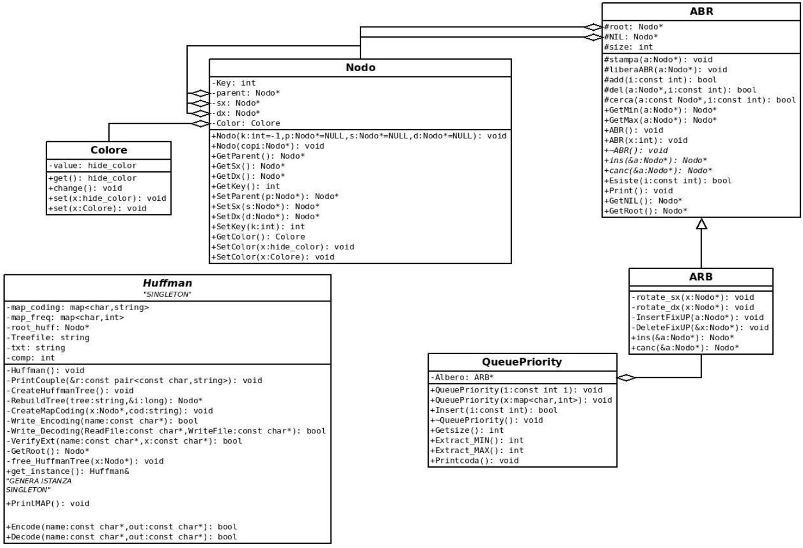

# Huffman-Coding-using-red-black-tree
Implementation of huffman coding using red-black trees as a priority queue.

A very thorough description of this implementation (only in Italian) is present in the pdf included in the repository.

Unified Modeling Language:

